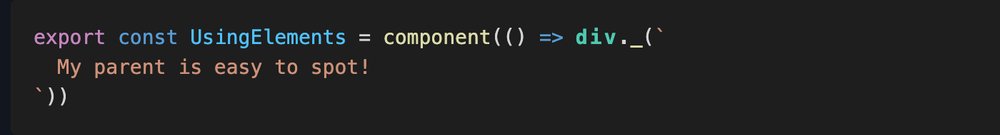
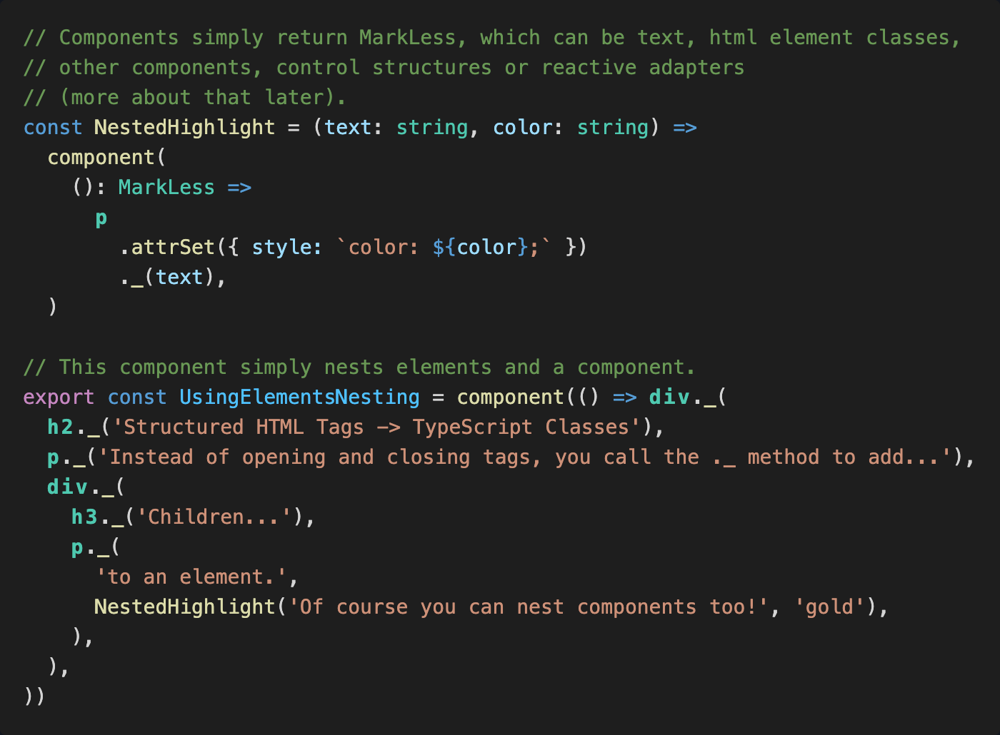
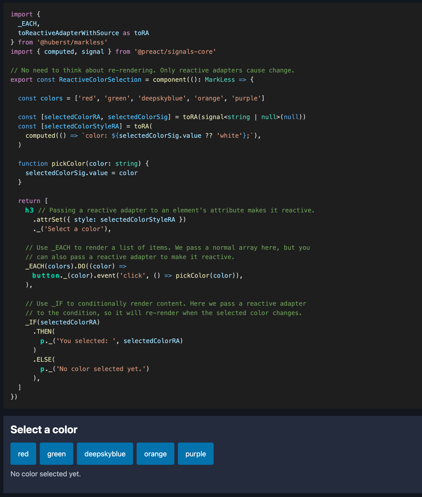
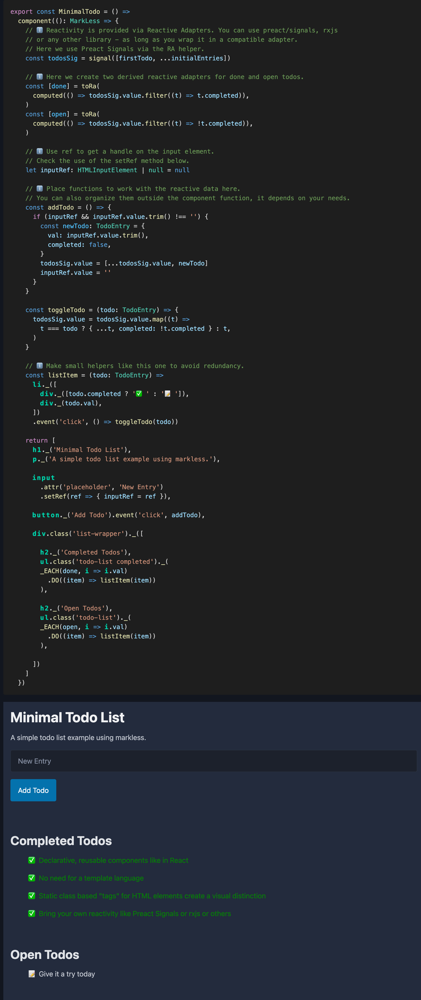
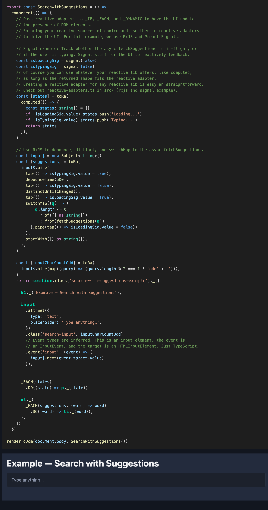

> ⚠️ Semantic highlighting is not possible in Markdown code blocks. For
> markless, however, this representation is important to understand the
> principle. Therefore, the code examples in this README are provided as images.
> You can find text based examples with syntax highlighting at
> https://huberst.github.io/markless/

<picture>
  <source media="(prefers-color-scheme: dark)" srcset="page/assets/logo-dark.svg">
  <source media="(prefers-color-scheme: light)" srcset="page/assets/logo-light.svg">
  
</picture>

<!--  -->

**Plain TypeScript - Reactive - UI Components**

markless is a library which allows you to build UI for the browser, with a dev
experience somewhat similar to React, but without having to leave or enhance
TypeScript-Land.

## How to install

Add markless to a Deno project from JSR:

```sh
deno add jsr:@huberst/markless
```

## The Mission: HTML-level scannability, pure TS

The biggest hurdle was to achieve a visual distinction of HTML elements from the
rest of the syntax. Because that is what XML and thus HTML and JSX are so strong
at: You can quickly grasp the structure of the document.

First I tried to make the HTML elements visually striking, by using underscores
or special characters, like in these examples:

- `_div_`
- `__div__`
- `$_div`
- `$_DIV`

But none of these really helped scanning a component as quickly with your eyes,
as you can with HTML / JSX.

Then I found a little trick to make it work: **Using static members on classes,
with one class for each HTML element!**

Most themes for syntax highlighting will highlight classes noticeably different,
so they are easy to spot for your eyes. In VS Code Dark Modern, for example,
they are colored in a green or almost turquoise color, which is also used for
type information.





### What are the benefits of this approach?

- No need for a template language syntax like JSX, lit-html, or similar and
  their overhead.
- Therefore no editor / IDE extension for that syntax.
- No extra type-checking logic for that syntax.
- No build step required to transform that syntax into JS/TS.
- No virtual DOM.
- No magic.

## But what about reactivity?

markless components never 're-render' in the sense of React or Vue. All updates
are driven by reactive adapters, which can be build on top of any reactive
source you like. Reactive adapters for preact signals and RxJS are already
included. They are easy to integrate.



## Of course there is a todo app example 🙄



## Mixing multiple reactive sources



## License

[MIT](LICENSE) © 2026 Stefan Huber
